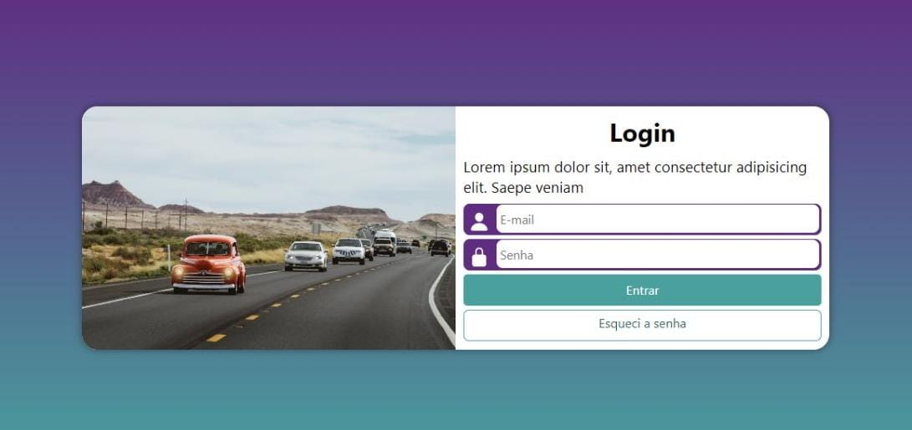

# AivanCar

O projeto AivanCar, teve seu "começo" através de um curso gratuito na plataforma YouTube, O canal tem seu nome como Curso em Vídeo, fornecido pelo professor Guanabara.

AivanCar é um projeto com o objetivo igual a qualquer outra tela de login, porém não é qualquer tela de login, e sim uma tela onde vc pode acessar um site de carros, concessionária, etc...

## Demonstração

## 💻 Tech Stack:
  
  
 

## Material

https://www.youtube.com/watch?v=4NB0_DPpjak

## Licença

[MIT License](https://choosealicense.com/licenses/mit/)

## Suporte

Para suporte, mande um email para ivan.rocha.0987@gmail.com ou entre em contato via whatsapp (41) 98468-5317.

## Feedback

Se você tiver algum feedback, por favor enviar para ivan.rocha.0987@gmail.com

## Autores

- [@IvanRocha](https://www.github.com/ivanrocha10)
- [@CursoEmVideo](https://github.com/gustavoguanabara)

## Projeto

  Acesse o "AivanCar" pelo QR:

  

Caso o QR não funcione, acesse <a href="https://ivanrocha10.github.io/AivanCar/">aqui</a>